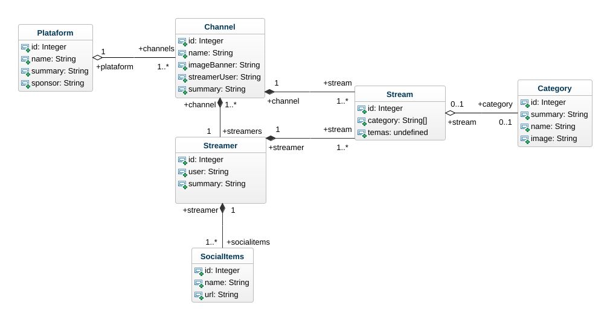

# Proyecto Streamers

Resolviendo el siguiente [enunciado](./enunciado.md).

## Contenidos
1. [Repositorio](https://github.com/kashipu/streamer-finder)
2. [Modelo de clases](#modelo-de-clases)


## Modelo de clases


## Glosario de terminos

### Clases
1. Channel
2. Category
3. Platform
4. SocialLinks
5. Stream
6. Streamer

## Relaciones
- Ver diagrama
### Métodos


### ¿Cómo iniciar?

1. Clonar el repositorio desde github
2. iniciar npm con el comando
```
npm init
```
3. instalar las dependiencias
```
npm install
```
4. Iniciar la compilación si no existe la carpeta dist
```
npx tsc -w
```
5. abrir el archivo html que se encuenta en la carpeta dist en su navegador

6. Si el archivo del navegador muestra el mensaje "Archivo cargado" abra las herramientas del navegador


# Stream finder


